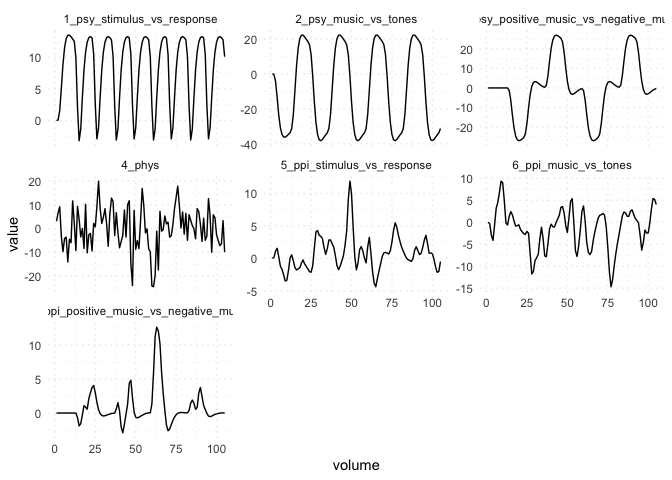
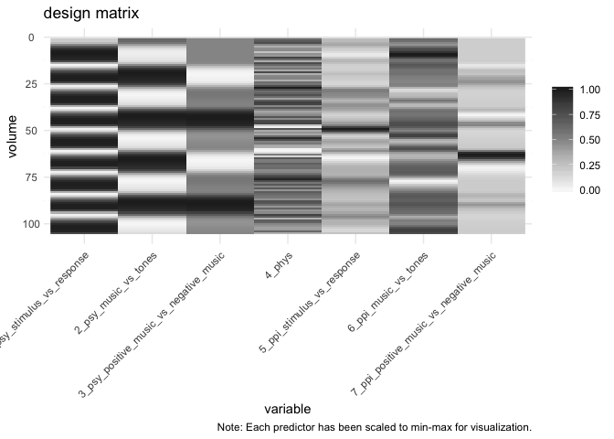

# `ppi` : Psychophysiological Interaction (PPI)

<!-- badges: start -->

[](https://www.tidyverse.org/lifecycle/#experimental)
<!-- badges: end -->

A neuroimaging package to “easily” perform PPI analyses for task
functional magnetic resonsnace imaging (fMRI).

Note: This package is still being developed and will likely change a
lot. Please use cautiously.

## Installation

``` r
devtools::install_github("epongpipat/ppi")
```

## Data Wrangling

Go from a 3-column format events file (i.e., columns of onset, duration,
trial\_type) and a physiological time series from a region of interest
to a PPI design matrix in seconds\!

``` r
library(ppi)
library(dplyr)

# define hrf ----
hrf <- create_hrf_afni(hrf = "spmg1", tr = 3, upsample_factor = 16)

# load events file ----
psy_url <- "https://openneuro.org/crn/datasets/ds000171/snapshots/00001/files/sub-control01:func:sub-control01_task-music_run-1_events.tsv"
psy_events <- readr::read_tsv(url(psy_url)) %>%
  mutate(trial_type = as.factor(trial_type))

# define contrast code ----
# orthogonal contrast code:
# 1. stimulus vs response
# 2. music vs tones
# 3. positive music vs negative music
psy_contrast_table <- cbind(stimulus_vs_response = c(1, 1, -3, 1)/4,
                            music_vs_tones = c(1, 1, 0, -2)/3,
                            positive_music_vs_negative_music = c(-1, 1, 0, 0)/2)

# load physiological time series data from region of interest ----
phys_file <- "examples/sub-control01_task-music_run-1_bold_space-subj_vox-32-24-38.csv"
phys_data <- readr::read_csv(phys_file, col_names = F)

tictoc::tic()
data_wrangling <- data_wrangling(psy_events_data = psy_events, 
                                 psy_unlabeled_trial_type = "response", 
                                 psy_contrast_table = psy_contrast_table, 
                                 phys_data = phys_data, 
                                 detrend_factor = 2,
                                 hrf = hrf, 
                                 tr = 3, 
                                 n_volumes = 105, 
                                 upsample_factor = 16, 
                                 deconvolve = TRUE,
                                 afni_quiet = TRUE)
tictoc::toc()
```

    ## 1.75 sec elapsed

Everything is saved as a list, which includes the input parameters and
every single step of the data wrangling pipeline.

``` r
Hmisc::list.tree(data_wrangling, depth = 3)
```

    ##  data_wrangling = list 5 (230616 bytes)
    ## .  params = list 3
    ## . .  mri = list 2
    ## . .  ppi = list 3
    ## . .  hrf = list 1( data.frame )
    ## .  psy_var = list 7
    ## . .  events = list 3( data.frame )
    ## . .  trial_type_by_volume = list 2( data.frame )
    ## . .  contrast_table = list 3( data.frame )
    ## . .  contrast = list 3( data.frame )
    ## . .  upsample = list 3( data.frame )
    ## . .  convolve = list 3( data.frame )
    ## . .  downsample = list 3( data.frame )
    ## .  phys_var = list 4
    ## . .  input = list 1( data.frame )
    ## . .  detrend = list 1( data.frame )
    ## . .  upsample = list 1( data.frame )
    ## . .  deconvolve = list 1( data.frame )
    ## .  ppi_var = list 3
    ## . .  interaction = list 3( data.frame )
    ## . .  convolve = list 3( data.frame )
    ## . .  downsample = list 3( data.frame )
    ## .  design_matrix = list 7( data.frame )
    ## . .  psy_stimulus_vs_response = double 105= 0 0.10078 1.5873 ...
    ## . .  psy_music_vs_tones = double 105= 0 -0.26874 -4.2329 ...
    ## . .  psy_positive_music_vs_negative_music = double 105= 0 0 0 0 0 0 0 0 ...
    ## . .  phys = double 105= 3.0961 6.6414 9.1888 ...
    ## . .  ppi_stimulus_vs_response = double 105= 0 0.13324 1.1015 ...
    ## . .  ppi_music_vs_tones = double 105= 0 -0.35531 -2.9373 ...
    ## . .  ppi_positive_music_vs_negative_music = double 105= 0 0 0 0 0 0 0 0 ...
    ## . A  row.names = integer 105= 1 2 3 4 5 6 7 8 ...

#### Need more flexibility?

You can create each individual set of variables using
`create_psy_var()`, `create_phys_var()`, and `create_ppi_var()` or
create every step of each variable using
<a href="https://ekarinpongpipat.com/ppi/reference/index.html#section-data-wrangling" target="_blank">these</a>
data wrangling functions.

### Visualization

Visualize the data as a time series or a heatmap.

``` r
visualize_time_series(data = data_wrangling$design_matrix, 
                      scales = "free_y")
```

<!-- -->

``` r
visualize_time_series_heatmap(data = data_wrangling$design_matrix, 
                              scale_data = "min-max",
                              title = "design matrix",
                              caption = "Note: Each predictor has been scaled to min-max for visualization.",
                              reverse_volume_axis = T,
                              palette = "Greys", 
                              palette_direction = 1,
                              transpose = T)
```

<!-- -->

### Save and Report

Save the output as both an .rds
(<a href="https://github.com/epongpipat/ppi/blob/master/examples/data_wrangling.rds" target="_blank">example</a>)
and .json
(<a href="https://github.com/epongpipat/ppi/blob/master/examples/data_wrangling.json" target="_blank">example</a>)
file for continued use in R or other languages, respectively.

``` r
save_data_wrangling(data_wrangling)
```

Create a report of the entire pipeline
(<a href="https://ekarinpongpipat.com/ppi/data_wrangling_report.html" target="_blank">example</a>).

``` r
create_data_wrangling_report(data_wrangling)
```

## Under Development

#### Analysis

``` r
tictoc::tic()
model <- model_glm_roi2roi(data_wrangling$phys$detrend, data_wrangling$design_matrix)
tictoc::toc()

model
Hmisc::list.tree(model, depth = 3)
```

## Acknowledgements

This package relies on a variety of R packages (i.e., `tidyverse`,
`afnir`, `furrr`) and neuroimaging programs (i.e, AFNI and FSL).

Note: AFNI and FSL functions will eventually (hopefully) be replaced so
that the package only uses R.

## PPI References:

Friston, K. J., Buechel, C., Fink, G. R., Morris, J., Rolls, E., &
Dolan, R. J. (1997). Psychophysiological and modulatory interactions in
neuroimaging. NeuroImage, 6(3), 218–229.
<https://doi.org/10.1006/nimg.1997.0291>

Gitelman, D. R., Penny, W. D., Ashburner, J., & Friston, K. J. (2003).
Modeling regional and psychophysiologic interactions in fMRI: The
importance of hemodynamic deconvolution. NeuroImage, 19(1), 200–207.
<https://doi.org/10.1016/S1053-8119(03)00058-2>

McLaren, D. G., Ries, M. L., Xu, G., & Johnson, S. C. (2012). A
generalized form of context-dependent psychophysiological interactions
(gPPI): A comparison to standard approaches. NeuroImage, 61(4),
1277–1286. <https://doi.org/10.1016/j.neuroimage.2012.03.068>

Cisler, J. M., Bush, K., & Steele, J. S. (2014). A comparison of
statistical methods for detecting context-modulated functional
connectivity in fMRI. NeuroImage, 84, 1042–1052.
<https://doi.org/10.1016/j.neuroimage.2013.09.018>

Di, X., Reynolds, R. C., & Biswal, B. B. (2017). Imperfect
(de)convolution may introduce spurious psychophysiological interactions
and how to avoid it. Human Brain Mapping, 38(4), 1723–1740.
<https://doi.org/10.1002/hbm.23413>
